# Talkdesk secure delivery demo

This repository is a runnable demonstration of agents augmenting a weak manual CI/CD process without letting an agent decide deterministic security policy. Aiden installs a reviewed security workflow, GitHub Actions performs the scans, Coolify redeploys one immutable application artifact to EC2, and Aiden explains the resulting evidence.

```mermaid
flowchart LR
  PR["Application PR opened"] --> B["Aiden bootstrap webhook"]
  B --> C["Validated security-controls PR"]
  C -->|"special auto-merge exception"| U["Comment + update application branch"]
  U --> S["Gitleaks, Semgrep, Trivy, tests, OPA"]
  S -->|"all deterministic checks pass"| M["Manual application approval and merge"]
  M --> D["Coolify redeploys immutable image digest"]
  D --> P["Direct Nmap, AWS, WAF, TLS, and auth assessment"]
  P --> R["SOC 2-oriented report + Linear ticket"]
```



## What is built

- `app/`: TypeScript/Express sample app with JWT compliance checks and OpenTelemetry metrics, logs, and traces.
- `infra/aws/`: VPC, ALB, HTTPS redirect, WAF header rule, EC2/Coolify host, restricted ingress/egress, SSM access, evidence bucket, and GitHub OIDC evidence role.
- `infra/grafana/`: ObserveNow Grafana folder, correlated dashboard, and alert rule using the existing VictoriaMetrics, Loki, Jaeger, and CloudWatch data sources.
- `aiden/`: three StackGen/Aiden workflows, agents, policies, integrations, Automation webhooks, budgets, and runbooks.
- `.github/workflows/`: persistent bootstrap, deployment, controls validation, and protected reset workflows.
- `demo/control-templates/`: reviewed, digest-pinned security gate that Aiden injects as `.github/workflows/security-gate.yml`.
- `policies/` and `scripts/`: deterministic OPA controls, bounded post-deployment probes, evidence normalization, and report generation.

## Execution behavior

1. A same-repository application PR opens. The persistent `Aiden security-control bootstrap` workflow calls the Aiden Automation webhook.
2. Aiden verifies the repository and current head SHA. If the gate is absent, it opens a `security-controls/*` PR containing only the byte-identical reviewed workflow.
3. `Validate security controls` verifies the dedicated bot identity, branch, single allowlisted path, and SHA-256 manifest. Aiden then merges only its own controls PR without approving it.
4. Aiden creates/verifies the dedicated `security-gate` ruleset, comments on the original PR, and updates that branch from `main` with GitHub's compare-and-swap `expected_head_sha` operation. That update creates the fresh event and SHA needed to run the newly installed gate.
5. Gitleaks, Semgrep, Trivy, unit/auth tests, npm audit, and OPA run. Their deterministic `security-gate` check must pass. Aiden posts a correlated explanation; a human still approves and merges the application PR.
6. The deployment workflow independently verifies that `security-gate` succeeded for the recorded application head SHA, then asks Coolify to redeploy the same reviewed image digest. Coolify's Deployments view and logs show progress while the workflow polls the deployment API.
7. After deployment, the expedited Aiden workflow directly checks public ports, EC2 security-group ingress/egress, ALB listeners, WAF attachment/header behavior, HTTPS/TLS behavior, and unauthenticated JWT failure cases. A workflow workspace and VictoriaMetrics/Loki/Jaeger/OpsVerse correlation are not required; observability is explicitly marked NOT ASSESSED. Aiden publishes the redacted SOC 2-oriented assessment and then creates one Linear ticket.
8. The protected reset workflow reverts the recorded application and controls merge commits and removes only the demo ruleset/branches. It does not redeploy or modify EC2, Coolify, Aiden, Grafana, or historical telemetry.

Start with [docs/DEMO_RUNBOOK.md](docs/DEMO_RUNBOOK.md). Credentials previously pasted into chat are treated as compromised and must be rotated before any apply or deployment.

## Local validation

```bash
make init
make validate
```

The Aiden root additionally requires a real StackGen URL, PAT, and exact human workspace name before a saved plan can be generated and audited.
